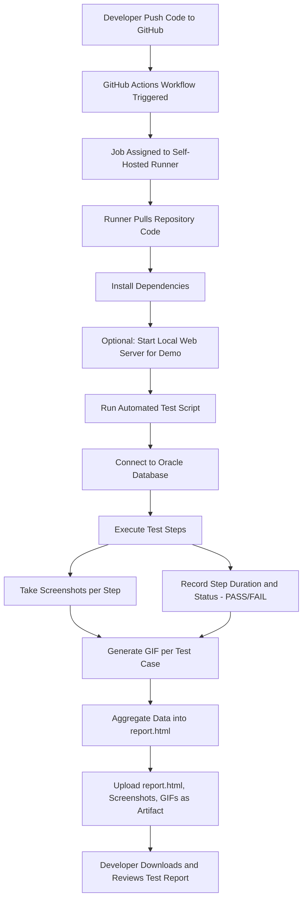

AI-Test-Recorder CI/CD 流程示意

下面是 GitHub Actions + 自建 Runner + Oracle 自动测试的完整流程图示意：

流程节点说明
	1.	Push 代码触发 Workflow: 开发者提交代码或发起 PR。
	2.	Workflow 分配到自建 Runner: 运行环境可以访问 Oracle 数据库和内部服务。
	3.	Runner 拉取仓库并安装依赖: Python、Playwright、Oracle 客户端等。
	4.	启动本地 Web Server (可选): 如果测试需要访问 demo 页面。
	5.	执行测试脚本: 运行录制的测试步骤。
	6.	连接 Oracle 数据库: 执行涉及数据库的测试操作。
	7.	执行步骤并截图: 每步执行状态和持续时间记录。
	8.	生成 GIF: 每个测试用例生成回放动画。
	9.	生成 HTML 报告: 汇总 case 和 step 数据。
	10.	上传 Artifact: 将报告和截图上传到 GitHub Actions 供团队下载。
	11.	查看报告: 团队可下载 artifact，分析失败步骤和执行结果。